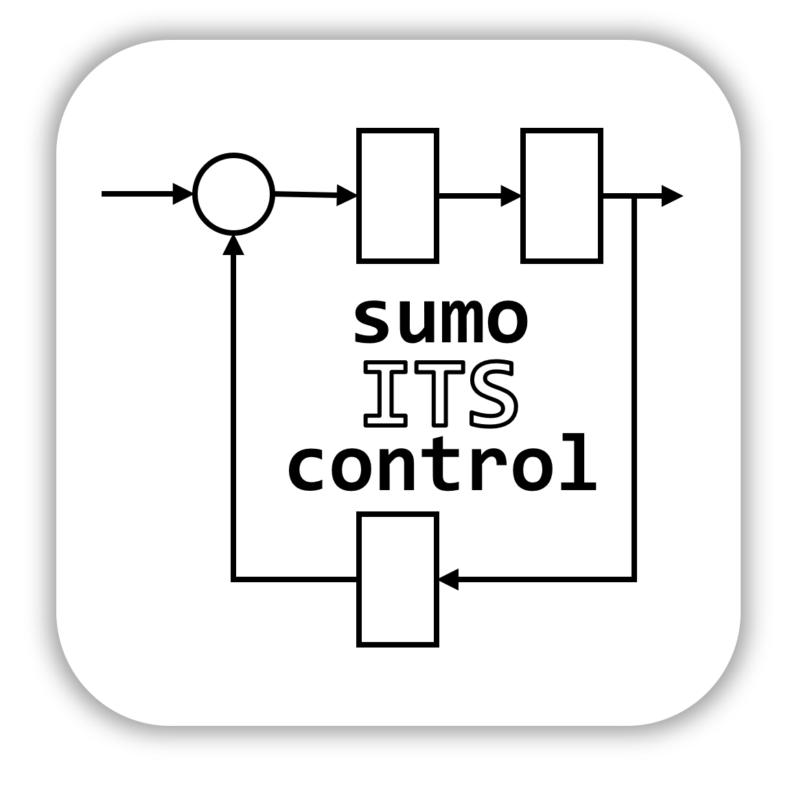
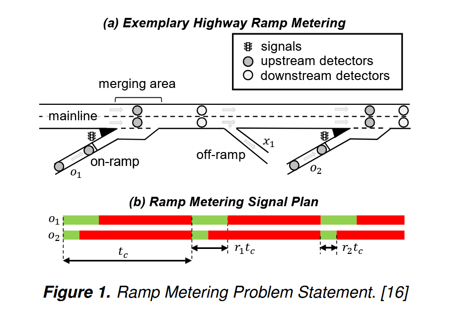
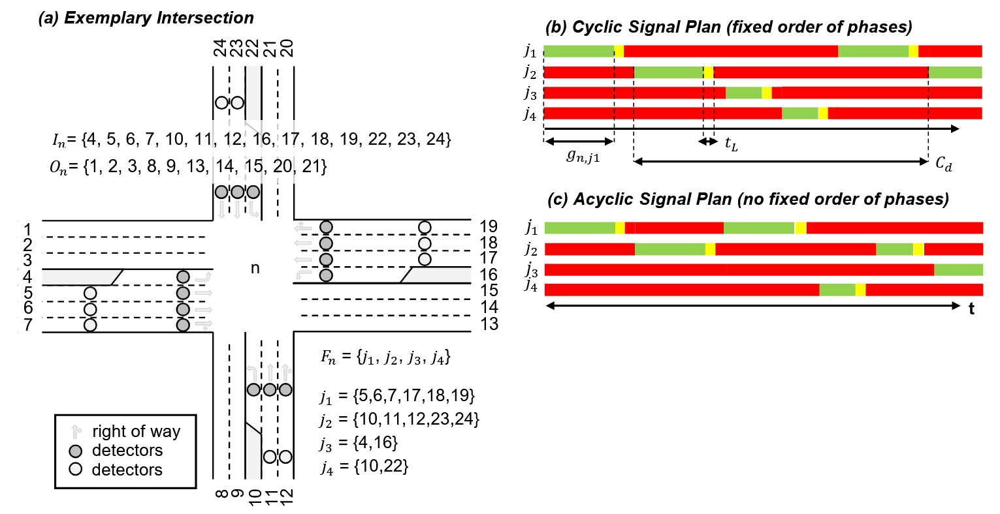
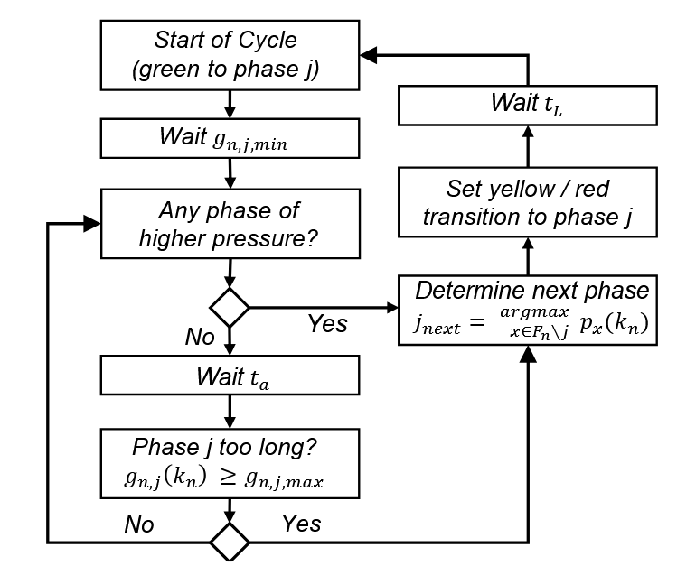
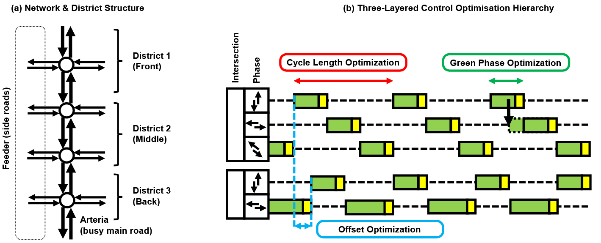
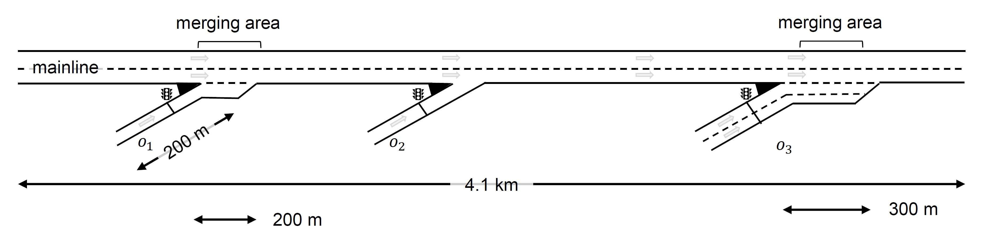
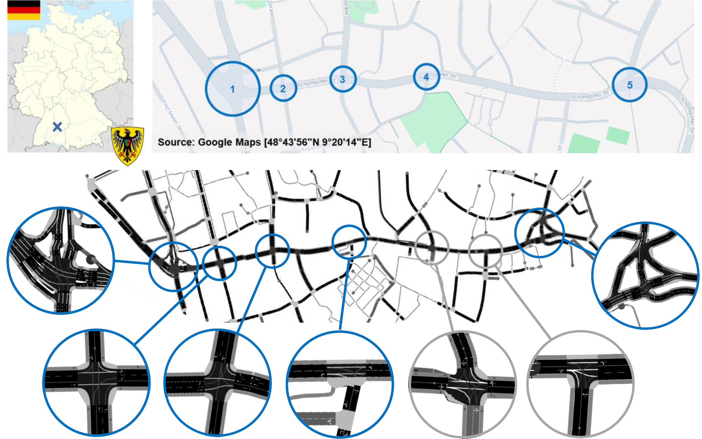

<h1>
    <center>
    <table width="100%">
        <tr>
            <td align="center">
                
                sumoITScontrol  
            </td>
        </tr>
        <tr>
            <td align="center">
                Traffic Controller Collection for SUMO Traffic Simulatons
            </td>
        </tr>
    </table>
    </center>
</h1>

[](https://pypi.org/project/sumoITScontrol/)
[](https://www.gnu.org/licenses/gpl-3.0)
[](https://github.com/DerKevinRiehl/sumo3Dviz/actions/workflows/build.yml)
[](https://github.com/DerKevinRiehl/sumo3Dviz/actions/workflows/test_rendering.yml)

**sumoITScontrol** is an open-source Python framework that provides a standardized collection of established traffic controllers for the SUMO simulator for signal control and freeway ramp metering algorithms. 
It enables reproducible, variance-aware benchmarking of intelligent traffic control methods through consistent implementations and rigorous evaluation practices.

<details>
<summary><strong>Table of Contents</strong></summary>

- [Highlights](#highlights)
- [Installation](#installation)
- [Usage](#usage)
- [Case Study Demonstrations](#case-study-demonstrations)
  - [Ramp Metering](#ramp-metering)
  - [Signalised Intersection Management](#signalised-intersection-management)
  - [Calibration / Fine-Tuning of Control Parameters](#calibration)
- [Documentation](#documentation)
  - [Control Context Objects](#control-context-objects)
    - [RampMetering](#rampmetering)
    - [RampMeteringCoordinationGroup](#rampmeteringcoordinationgroup)
    - [Intersection](#intersection)
    - [IntersectionGroup](#intersectiongroup)
  - [Ramp Metering](#ramp-metering)
    - [ALINEA](#alinea)
    - [HERO](#hero)
    - [METALINE](#metaline)
  - [Signalised Intersection Management](#signalised-intersection-management)
    - [Max-Pressure (Fixed-Cycle)](#max-pressure-fixed)
    - [Max-Pressure (Flexible-Cycle)](#max-pressure-flexible)
    - [SCOOT/SCATS](#scoot/scats)
- [Citations](#citations)
</details> 


## Highlights

<center>
<table>
    <tr>
        <td colspan="2"><b><center>Covered Controllers</center></b></td>
    </tr>
    <tr>
        <td><center><i>Intersection Management</i></center></td>
        <td><center><i>Ramp Metering</i></center></td>
    </tr>
    <tr>
        <td>
            <ul>
                <li>Max-Pressure (Fixed Cycle)</li>
                <li>Max-Pressure (Flexible Cycle)</li>
                <li>SCOOT/SCATS</li>
                <li>...</li>
            </ul>
        </td>
        <td>
            <ul>
                <li>ALINEA</li>
                <li>HERO</li>
                <li>METALINE</li>
                <li>...</li>
            </ul>
        </td>
        <td>
    </tr>
</table>

<table>
    <tr>
        <td> <a href="resources/highlight_ramp.PNG" >  </a> </td>
        <td> <a href="resources/highlight_inter.PNG" >  </a> </td>
        <td> <a href="resources/highlight_fsm.PNG" >  </a> </td>
        <td> <a href="resources/highlight_scosca.PNG" >  </a> </td>
    </tr>
</table>


</center>

### **==> Link to [Documentation](#documentation) Page <==**

## Installation
The python package **sumoITScontrol** can be installed using pip:
```bash
pip install sumoITScontrol
```

## Usage

You can use sumoITScontrol as a Python library to easily integrate ITS controllers into your SUMO simulations.
For this, you need to include only one line of code into your main loop when using SUMO with TraCI.
Certain preparation, such as defining sensors and traffic lights, or control parameters, is necessary additionally.
The usage is exemplified at the example of ALINEA controler and ramp metering.
*For further details, please see the section on [Case Study Demonstrations](#case-study-demonstrations).*

**Step 1: Define Sensors and Traffic Lights**

You need to provide a control context such as a `RampMeter` or `RampMeterCoordinationGroup` in the context of ramp metering, and `Intersection` or `IntersectionGroup` in the context of signalised intersection management.
The context informs sumoITScontrol about relevant sensors (`e2_5`, `e2_4`, `e2_0`) and traffic lights (`J0`).

``` python
ramp_meter = RampMeter(
    tl_id="J0",
    mainline_sensors=["e2_5", "e2_4"],
    queue_sensors=["e2_0"],
)
```

**Step 2: Define Control Parameters**

You need to provide a controller and relevant parameters to connect the controller to the control context such as `ALINEA`, `HERO`, or `METALINE` in the context of ramp metering, and `MaxPressure_Fix`, `MaxPressure_Flex` or `ScootScats` in the context of singalised intersection management.

``` python
controller = ALINEA(
    params={
        "target_occupancy": 10,
        "K_P": 30,
        "K_I": 0,
        "cycle_duration": 60,
        "measurement_period": int(
            60 / 0.5
        ),  # int(cycle_duration / simulation.time_step)
        "min_rate": 5,
        "max_rate": 100,
    },
    ramp_meter=ramp_meter,
)
```

**Step 3: Add One Line to Main Loop**

Any SUMO simulation that is executed with TraCI somehow has the structure of starting traci, inside a loop calling `traci.simulationStep()` for the duration of the simulation, and then closing traci.
Anything you have to do (for most controllers) is to simply add one line of code inside your loop, as outlined below.
**Please Note:** For the controller `ScootScats`, you might need to add one line to the initialization (after `traci.start()` but before `traci.simulationStep()`). *For further details, please see the section on [Case Study Demonstrations](#case-study-demonstrations).*

``` python
# Start Sumo
traci.start(SUMO_CMD)
# Initialize
# Execute Simulation
for simulation_timestep in range(0, SIMULATION_DURATION):
    # run one step
    traci.simulationStep()
    # retrieve time
    current_time = traci.simulation.getCurrentTime()
    # execute control
    controller.execute_control(current_time) # <-- !!! ADD THIS LINE !!!
# Stop Sumo
traci.close()
```

## Case Study Demonstrations

Demo Python scripts and SUMO simulations for each implemented controller can be found in the folder `.\sumoITScontrol\demos\*.py` and `.\sumoITScontrol\demos\demo_simulation_models\`.
The Python scripts open `sumo-gui` for the simulation, and afterwards render figures with control-relevant statistics as reported in the paper. 

There are three case studies:
- Control in the context of ramp metering
- Control in the context of signalised intersection management
- Calibration / Fine-tuning of control parameters

### Ramp Metering



<details>
The ramp metering case study consists of a network with three different ramp designs.
There are multiple different demand scenarios, to showcase the performance of local controllers (e.g. ALINEA), and coordinated controllers (e.g. HERO, METALINE). 

Relevant demos include:
```bash
python demo_ALINEA.py
python demo_HERO.py
python demo_METALINE.py
```
</details>


### Signalised Intersection Management



<details>
The signalised intersection management case study consists of an arterial network (Schorndorfer Strasse, Esslingen am Neckar) with seven intersections, where five are signalised (controlled).
The case study serves to demonstrate the performance of local controllers (e.g. Max-Pressure), and coordinated controllers (e.g. SCOOT/SCATS).

Relevant demos include:
```bash
python demo_MAX_FIX.py
python demo_MAX_FLEX.py
python demo_SCOSCA.py
```
</details>

### Calibration / Fine-Tuning of Control Parameters

<details>
At the example of the ramp metering study and the ALINEA controller, this script explores different parameters for ALINEA, by running SUMO simulations with different random seeds (20), and then reporting mean and standard deviation for different controller configurations (parameters).

Relevant demos include:
```bash
python demo_optimisation.py
```
which calls the python script `demo_optimisation_execute_script.py`.
</details>


## Documentation

This documentation lists specific details to control context objects and traffic control algorithms for ramp metering and signalised intersection management.

<details>

### Control Context Objects

#### RampMetering

This is the example of RampMetering object specification.
The sensors can be E2 sensors or E1 sensors.
```python
ramp_meter = RampMeter(
    tl_id="J0",
    mainline_sensors=["e2_5", "e2_4"],
    queue_sensors=["e2_0"],
)
```

#### RampMeteringCoordinationGroup

This is the example of RampMeterCoordinationGroup object specification.
The sensors can be E2 sensors or E1 sensors.
```python
ramp_meter_group = RampMeterCoordinationGroup(
    ramp_meters_ordered=[
        RampMeter(
            tl_id="J12",
            mainline_sensors=["e1_13", "e1_14"],
            queue_sensors=["e2_1", "e2_2"],
            smoothening_factor=0.1,
            saturation_flow_veh_per_sec=0.5,
        ),
        RampMeter(
            tl_id="J11",
            mainline_sensors=["e1_2", "e1_3"],
            queue_sensors=["e2_3"],
            smoothening_factor=0.1,
            saturation_flow_veh_per_sec=0.5,
        ),
        RampMeter(
            tl_id="J0",
            mainline_sensors=["e2_5", "e2_4"],
            queue_sensors=["e2_0"],
            smoothening_factor=0.1,
            saturation_flow_veh_per_sec=0.5,
        ),
    ],
    ramp_meter_ids=["J12", "J11", "J0"],
)
```

#### Intersection

This is the example of Intersection object specification.
You can either provide a list of sensors (E2 sensors) or a list of lanes (links) to measure traffic states (queue lengths, degree of saturation).
If both are provided, sensors are taken first.
Provision of `green_states` and `yellow_states` is only necessary for SCOOT/SCATS.

```python
intersection2 = Intersection(
    tl_id="intersection2",
    phases=[0, 2, 4],
    # links = {0:["183049933#0_1", "-38361908#1_1"],
    #           2:["-38361908#1_1", "-38361908#1_2"],
    #           4:["-25973410#1_1", "758088375#0_1", "758088375#0_2"]},
    sensors={
        0: ["e2_183049933#0_1", "e2_-38361908#1_1"],
        2: ["e2_-38361908#1_1", "e2_-38361908#1_2"],
        4: ["e2_-25973410#1", "e2_758088375#0_1", "e2_758088375#0_2"],
    },
    green_states=["GGrrrGrr", "GGGrrrrr", "rrrGGrGG"],
    yellow_states=["yyrrryrr", "yyyrrrrr", "rrryyryy"],
)
```

#### IntersectionGroup

This is the example of IntersectionGroup object specification.
You can either provide a list of sensors (E2 sensors) or a list of lanes (links) to measure traffic states (queue lengths, degree of saturation).
If both are provided, sensors are taken first.

```python
intersection1 = Intersection(
    tl_id="intersection1",
    ...
)
intersection2 = Intersection(
    tl_id="intersection2",
    ...
)
intersection3 = Intersection(
    tl_id="intersection3",
    ...
)
intersection4 = Intersection(
    tl_id="intersection4",
    ...
)
intersection5 = Intersection(
    tl_id="intersection5",
    ...
)
districts = {
    "front": ["intersection1", "intersection2"],
    "middle": ["intersection3", "intersection4"],
    "back": ["intersection5"],
}
critical_district_order = {
    "front": [
        "intersection1",
        "intersection2",
        "intersection3",
        "intersection4",
        "intersection5",
    ],
    "middle": [
        "intersection3",
        "intersection2",
        "intersection4",
        "intersection1",
        "intersection5",
    ],
    "back": [
        "intersection5",
        "intersection4",
        "intersection3",
        "intersection2",
        "intersection1",
    ],
}
connection_between_intersections = {
    "intersection1": ["183049934_1", "183049933#0_1", "1164287131#0_1"],  # To Int 2
    "intersection2": ["38361908#1_1", "E3_1"],  # To Int 3
    "intersection3": [
        "E1_1",
        "758088377#1_1",
        "758088377#2_1",
        "22889927#0_1",
    ],  # To Int 4
    "intersection4": [
        "22889927#2_1",
        "22889927#3_1",
        "22889927#4_1",
        "387296014#0_1",
        "387296014#1_1",
        "696225646#1_1",
        "696225646#2_1",
        "696225646#3_1",
        "130569446_1",
        "E5_1",
        "E6_1",
    ],  # To Int 5
}
intersection_group = IntersectionGroup(
    intersections=[
        intersection1,
        intersection2,
        intersection3,
        intersection4,
        intersection5,
    ],
    districts=districts,
    critical_district_order=critical_district_order,
    connection_between_intersections=connection_between_intersections,
)
```

### Ramp Metering

#### ALINEA

This is the example of ALINEA object specification.

```python
controller = ALINEA(
    params={
        "target_occupancy": 10,
        "K_P": 30,
        "K_I": 0,
        "cycle_duration": 60,
        "measurement_period": int(
            60 / 0.5
        ),  # int(cycle_duration / simulation.time_step)
        "min_rate": 5,
        "max_rate": 100,
    },
    ramp_meter=ramp_meter,
)
```

#### HERO

This is the example of HERO object specification.

```python
controller = HERO(
    params={
        "hero_cycle_duration": 60,  # similar to ALINEA cycle duration
        "queue_activation_threshold_m": 15.0,  # master queue trigger
        "queue_release_threshold_m": 2.5,  # dissolve cluster
        "min_queue_setpoint_m": 5.0,  # for slaves
        "anticipation_factor": 1.0,  # factor to obtain nonconservative prediction of demand to come in next control period
        "avg_vehicle_spacing": 7.5,  # average vehicle spacing to convert meters to vehicles and vice versa, from queue length measurements
    },
    coordination_group=ramp_meter_group,
    alinea_controllers={
        "J12": alinea_controller1,
        "J11": alinea_controller2,
        "J0": alinea_controller3,
    },
)
```

#### METALINE

This is the example of METALINE object specification.

```python
controller = METALINE(
    params={
        "cycle_duration": 60,  # control cycle
        "measurement_period": int(
            60 / 0.5
        ),  # int(cycle_duration / simulation.time_step)
        "min_rate": 5,
        "max_rate": 100,
    },
    coordination_group=ramp_meter_group,
    target_occupancies=[10, 10, 10],
    # Interaction gain matrix (3x3)
    K_P=np.array(
        [
            [30, -5, 0],  # ramp 1 influenced negatively by ramp 2
            [-3, 25, -2],  # ramp 2 influenced by neighbors
            [0, -4, 20],
        ]
    ),
    # Optional integral gain matrix
    K_I=np.zeros(shape=(3, 3)),
)
```

### Signalised Intersection Management

#### Max-Pressure (Fixed-Cycle)

This is the example of MaxPressure_Fix object specification.

```python
controller = MaxPressure_Fix(
    params={
        "T_L": 3,  # Yellow Time
        "G_T_MIN": 5,  # Min Greentime (used for Max. Pressure)
        "G_T_MAX": 50,  # Max Greentime (used for Max. Pressure)
        "measurement_period": int(1 / 0.25),  # int(1 / simulation.time_step)
        "cycle_duration": 120,
    }, 
    intersection=intersection1
)
```

#### Max-Pressure (Flexible-Cycle)

This is the example of MaxPressure_Flex object specification.

```python
controller = MaxPressure_Flex(
    params={
        "T_A": 5, # Recheck-Pressure Time (used for Max.Pressure)
        "T_L": 3,  # Yellow Time
        "G_T_MIN": 5,  # Min Greentime (used for Max. Pressure)
        "G_T_MAX": 50,  # Max Greentime (used for Max. Pressure)
        "measurement_period": int(1 / 0.25),  # int(1 / simulation.time_step)
        "cycle_duration": 120,
    }, 
    intersection=intersection1
)
```

#### SCOOT/SCATS

This is the example of ScootScats object specification.

```python
controller = ScootScats(
    scosca_params = {
        "adaptation_cycle": 30,
        "adaptation_green": 10,
        "green_thresh": 2,
        "adaptation_offset": 1,
        "offset_thresh": 0.5,
        "min_cycle_length": 50,
        "max_cycle_length": 180,
        "ds_upper_val": 0.925,
        "ds_lower_val": 0.875,
        "measurement_period": int(1 / 0.25),  # 1 / simulation_step_size
        "travel_time_adjustments": {
            "intersection1": ["183049934_1", 2],
            "intersection3": ["E1_1", 3],
            "intersection4": ["22889927#3_1", 9],
        },
        "intersection_offset_rules": {
            "intersection2": {
                "base_offset_from": None,
                "travel_time_from": "intersection2",
            },
            "intersection4": {
                "base_offset_from": None,
                "travel_time_from": "intersection3",
            },
            "intersection1": {
                "base_offset_from": "intersection2",
                "travel_time_from": "intersection1",
            },
            "intersection3": {
                "base_offset_from": "intersection4",
                "travel_time_from": "intersection4",
            },
            "default": {
                "base_offset_from": "intersection4",
                "travel_time_from": "intersection4",
            },
        },
    }, 
    intersection_group=intersection_group1, 
    initial_greentimes={
        "intersection1": [30, 30, 21],
        "intersection2": [30, 30, 21],
        "intersection3": [30, 30, 21],
        "intersection4": [40, 30],
        "intersection5": [30, 30, 21],
    },
    initial_cycle_length=120,
)
```

</details>


## Citations
Please cite our paper if you find sumoITScontrol useful:

```
@inproceedings{riehl2026sumoITScontrol,
  title={sumoITScontrol: Traffic Controller Collection for SUMO Traffic Simulations},
  author={Riehl, Kevin and Kouvelas, Anastasios and Makridis, Michail A.},
  booktitle={SUMO Conference Proceedings},
  year={2026}
}
```
